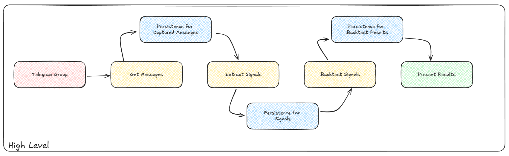
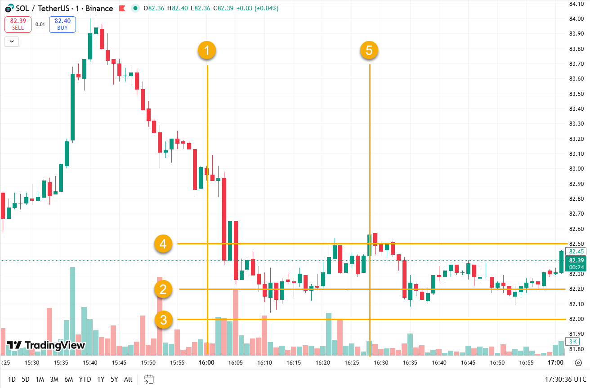
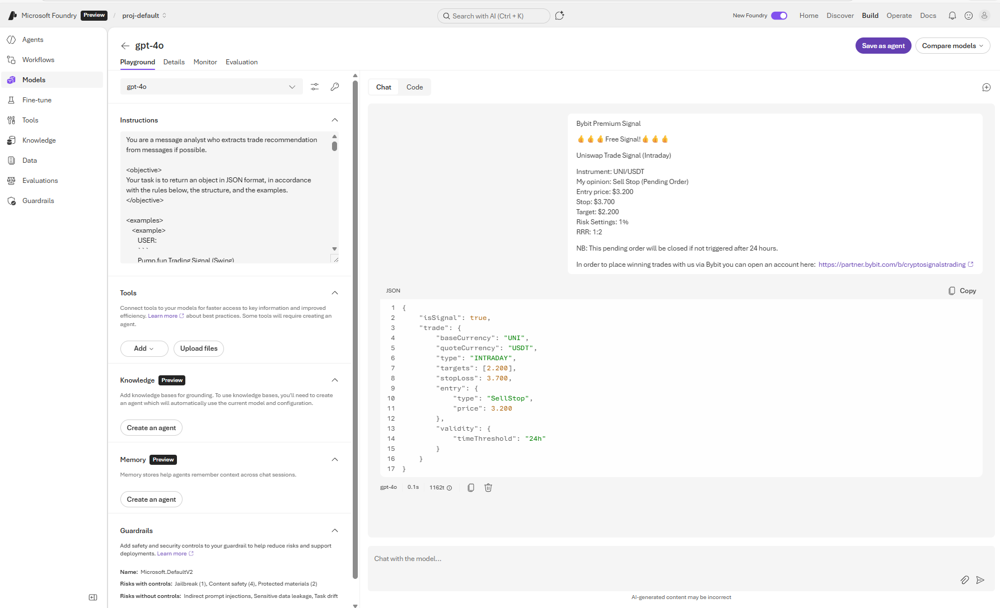
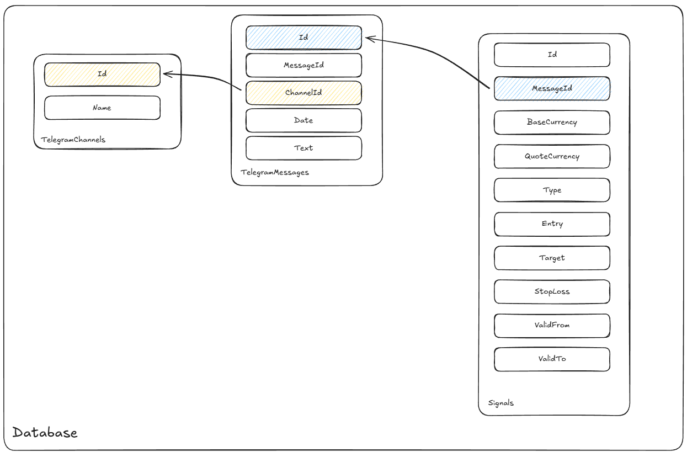

# Audit for Crypto Signal Groups  

> [!CAUTION]
> The current state of this repository is a dump of everything I do, so I don’t forget anything I need to describe and explain later. In its final form, you will find here documentation for deploying the solution yourself, along with a detailed explanation of how it works.

My goal is to build a solution whose purpose is to audit how effective Telegram crypto signal groups are, and to document the technical side of its implementation.

The diagram below shows the logic I plan to implement. The solution will be built from components with the following roles:
- download messages from selected Telegram groups
- extract trading signals from messages using GenAI
- verify signal performance using historical exchange data
- present the signal performance results

When building this solution, I also have some personal goals:
- build discipline and consistency by creating something regularly
- enjoy building something cool
- learn GenAI and play with it in practice

## What is trading signal?

Since in this project we will analyze how effective the signals are, it is worth saying a few words about what a signal is.

In short, a signal includes its exact date and a set of the following details: 
* what to buy and at what price
* at what price to take profit (usually more than one level)
* at what price to limit the loss
* the position direction (long/short).

Now let’s assume someone gives you advice and at 16:00 saying: _buy SOL/USDT below 82.2 and take profit (sell) as soon as it goes above 82.5, and if the price drops below 82 then sell and accept the loss_.

On the candlestick chart above from the exchange, we marked the following data:
1. the date and time of the signal — the signal timing will be key for its evaluation in backtesting
1. the price at which we should buy: 82.2 (entry price)
1. the price level where we exit the position and accept a loss (stop loss)
1. the price we are happy with and want to sell at (take profit)
1. the exact date and time when we end the trade

The signal could also be limited in time, which is not shown in the image above.

> [!IMPORTANT]
> Signal validation will simply be checking, using historical exchange data, whether a trade recommendation for a specific instrument—with the given entry, take profit, and stop loss prices—ended in profit or loss.

## Phase 1 - Prompt engineering - testing in playground

The first step was to check whether an LLM could extract the signals. For this, I used the playground available in Azure AI Foundry. Here is exactly what I did:
* deployed AI Foundry
* gathered some example signals from one of the groups
* prepared and tested multiple prompts and models
* checked if the output was promising enough to justify investing more time in development

The result of the actions above was the following artifacts and conclusions:
* confirmation that the use case I planned for the LLM makes sense

* [system prompt](./system-prompt.md) that we will test later with different models, mainly to find the best speed and cost efficiency 

## Phase 2 - Deploy development infrastructure

I had to start by designing the database schema, so I could automatically fetch Telegram messages and store them in the database. Trading signals will then be extracted from those messages (using GenAI) for backtesting. Below, I present the tables and the initial relationships between them.

In this project, the main focus is to play with GenAI, so for now, I deployed the infrastructure manually with just a few clicks, and thanks to the beauty of the cloud, Azure SQL Database and AI Foundry are ready for my local development. 

This solution doesn’t require private networking and entra id auth for database services, so we will use local auth. I capture SQL server server, database, username and password to `.env` file. It will be later used by our Python program to insert messages to database.

## Backlog 

### To Do
- deploy required infrastrcuture: models and db
- capture messages from telegram to db
- extract signals from messages and store them in db
- backtest signals and store results in db
- add dashboard with results
- automate solution
- automate solution deployment

### Done
- document what is signal and how it will be validated
- manually validate trading signal extraction with GenAI
- initialize repository with high-level concept description